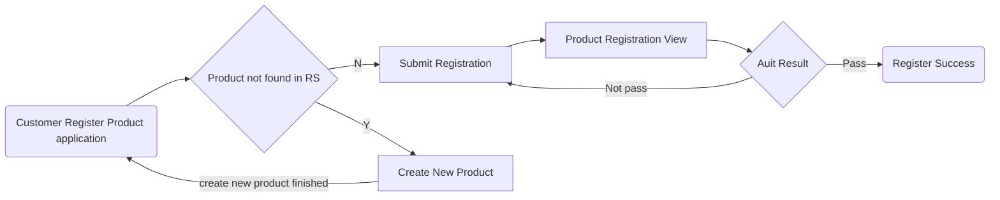
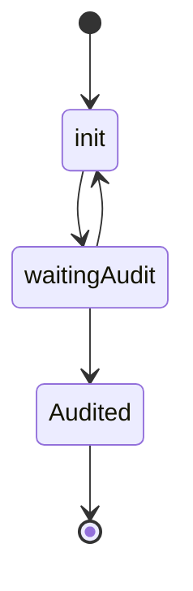
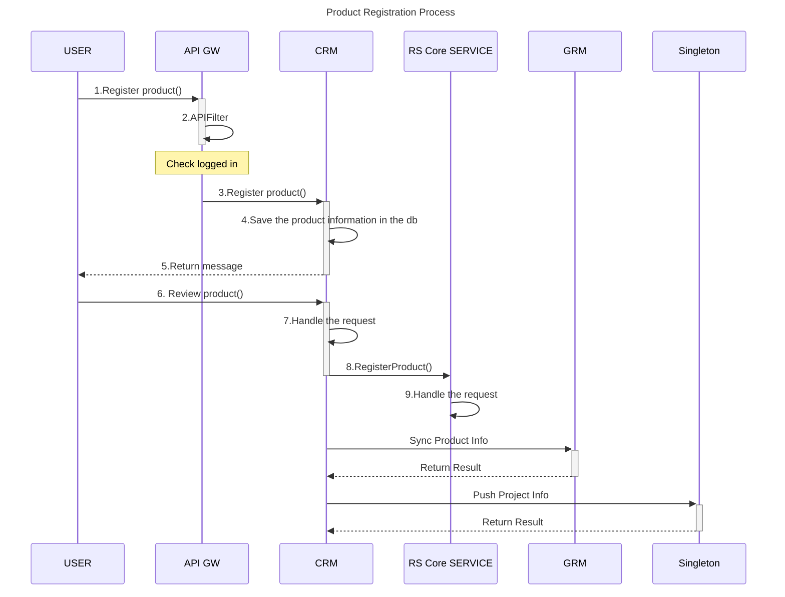
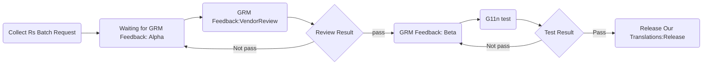
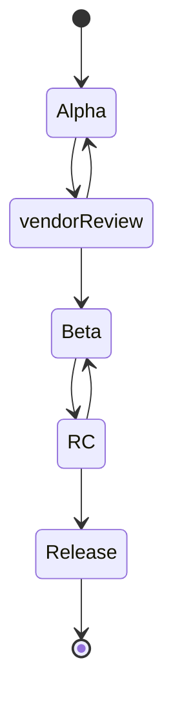
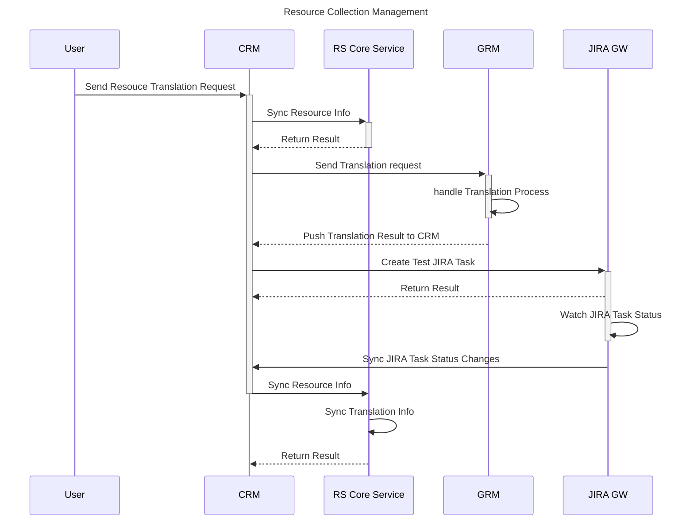

**Change Log**

| No   | Change Description     | Author | Version | Data       | Remark |
| ---- | ---------------------- | ------ | ------- | ---------- | ------ |
| 1    | Create Design V0.1 Doc | Kruan  | V0.1    | 2020.10.28 |        |

# Introduction

## Background

## Purpose and Scope

# Bussiness Overview

## Business Workflow 

### Product Registration

***Brief Introduction***

*This business is mainly to facilitate customer to **self-register** products in our system by UI, it includes the current **Singleton** and **GRM** product access methods.*

---

***Participating Role***

| No   | Role                | Operation                                                    |
| ---- | ------------------- | ------------------------------------------------------------ |
| 1    | Customer(Dev)       | - Product registration application and create new product request. |
| 2    | RS Product Reviewer | - Product registration Audit                                 |

---

***Bussiness Workflow***

**Notes:**

- *It is not allowed to deleted product registration order and modify some fields after product registration.*
- *Product registration in the **init** state allows modification and deletion.*

---

***Status Set***

---

***Module Interaction***

### Resource Management

***Brief Introduction***

*This service is mainly used to track the whole process of this batch of translations starting from the user initiating a batch of resource translation request.*

---

***Participating Role***

| No   | Role          | Operation                       |
| ---- | ------------- | ------------------------------- |
| 1    | Customer(Dev) | - RS collection request         |
| 2    | Vendor        | - Review transltations from Grm |
| 3    | QE            | - G11n test                     |

---

***Business Workflow***

**Notes:**

- *Need to consider whether to support users to cancel translation halfway*
- *Each process node adds corresponding reminders and automatically creates corresponding Jira tasks.*

---

***Status Set***

***Module Interation***

### 

